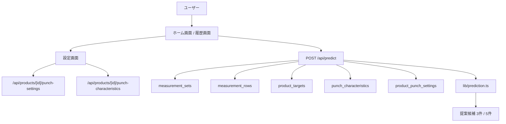

# シム提案機能 システム設計書

## システム構成図



## コンポーネント設計

### ホーム画面

対象: `components/MeasurementWorkspace.tsx`

- 得意先・製品選択の下にシム提案パネルを表示する。
- 「提案を計算」ボタンは、通知履歴ではなく得意先＋製品の最新測定データを使う。
- 表示件数は3件または5件から選択できる。
- 提案結果には以下を表示する。
  - 候補順位
  - 変更前後のシム厚み
  - 変更量
  - 予測測定値
  - 狙い値との差
  - 理由
  - 注意表示

### 履歴画面

対象: `components/HistoryWorkspace.tsx`

- 履歴詳細の中に「このデータで提案」ボタンを追加する。
- ボタン押下時は、対象の `measurementSetId` を使ってシム提案を実行できるようにする。
- 初回実装で画面遷移が複雑になる場合は、Should要件として段階実装に回す。

### 設定画面

対象候補:

- `app/settings/punch-characteristics`
- 新規 `app/settings/punch-settings`

設計方針:

- パンチ特性は既存の「パンチ特性」画面で管理する。
- シム変更範囲は新しい「パンチ設定」画面で管理する。
- パンチ設定は製品ごと、パンチごとに1件ずつ登録・編集する。

## DB設計

### 既存テーブル利用

#### measurement_sets

最新測定データの起点として使用する。

- `customer_id`
- `product_id`
- `measured_at`
- `current_shims`

最新データ取得条件:

```sql
where customer_id = :customerId
  and product_id = :productId
order by measured_at desc
limit 1
```

#### measurement_rows

測定6件の平均値を現在値として使う。

対象項目:

- `peak_load_g`
- `make_load_g`
- `click_rate_percent`
- `stroke_mm`
- `rlf_g`

#### product_targets

狙い値として使用する。登録済みの項目だけ評価対象にする。

#### punch_characteristics

パンチごとの影響方向と効きやすさとして使用する。

既存カラム:

- `punch`
- `key`
- `direction`
- `sensitivity`
- `min_effective_delta_mm`
- `max_recommended_delta_mm`

### 新規テーブル

#### product_punch_settings

パンチごとのシム変更候補範囲を保存する。

```sql
create table product_punch_settings (
  id uuid primary key default gen_random_uuid(),
  product_id uuid not null references products(id) on delete cascade,
  punch punch_type not null,
  min_delta_mm numeric not null default -0.02,
  max_delta_mm numeric not null default 0.02,
  step_delta_mm numeric not null default 0.001,
  is_enabled boolean not null default true,
  note text,
  created_at timestamptz not null default now(),
  updated_at timestamptz not null default now(),
  unique(product_id, punch),
  check (min_delta_mm <= max_delta_mm),
  check (step_delta_mm > 0)
);
```

初期値:

- `min_delta_mm`: `-0.02`
- `max_delta_mm`: `0.02`
- `step_delta_mm`: `0.001`
- `is_enabled`: `true`

## API一覧

### POST /api/predict

シム提案を計算する。

#### Request

```ts
type PredictRequest = {
  customerId?: string;
  productId?: string;
  measurementSetId?: string;
  candidateLimit?: 3 | 5;
};
```

#### 取得順

1. `measurementSetId` がある場合、その測定データを使う。
2. `measurementSetId` がない場合、`customerId + productId` の最新測定データを使う。
3. 最新測定データがない場合はエラーにする。
4. 通知履歴は参照しない。

#### Response

```ts
type PredictResponse = {
  sourceMeasurementSetId: string;
  sourceMeasuredAt: string;
  suggestions: PredictionSuggestion[];
};
```

### GET /api/products/[id]/punch-settings

製品ごとのパンチ設定を取得する。

### POST /api/products/[id]/punch-settings

製品ごとのパンチ設定を登録・更新する。

管理権限が必要。

### DELETE /api/products/[id]/punch-settings?id=...

製品ごとのパンチ設定を削除する。

管理権限が必要。

## ディレクトリ構成

```text
app/
  api/
    predict/route.ts
    products/[id]/punch-settings/route.ts
  settings/
    punch-settings/page.tsx
components/
  MeasurementWorkspace.tsx
  HistoryWorkspace.tsx
  PunchSettingsWorkspace.tsx
lib/
  prediction.ts
  types.ts
  db/mappers.ts
supabase/
  migrations/
    003_product_punch_settings.sql
docs/
  requirements-shim-suggestion.md
  design-shim-suggestion.md
```

## 計算ロジック設計

### 入力

- 現在測定値: 最新または指定測定データの測定6件平均
- 現在シム: `measurement_sets.current_shims`
- 狙い値: `product_targets`
- パンチ特性: `punch_characteristics`
- パンチ設定: `product_punch_settings`
- 表示件数: `3` または `5`

### 候補生成

1. 有効なパンチ設定だけを対象にする。
2. パンチごとの `min_delta_mm` から `max_delta_mm` まで、`step_delta_mm` 刻みで候補を生成する。
3. `0` の変更量は候補から除外する。
4. 初期実装では最大2パンチの組み合わせまで生成する。
5. パンチ特性が1件もないパンチは候補から除外する。

### 予測

- `direction = increase` の場合、シム変更量がプラスなら測定値を増加させる。
- `direction = decrease` の場合、シム変更量がプラスなら測定値を減少させる。
- `direction = none` は影響なし。
- `abs(deltaMm) < minEffectiveDeltaMm` の場合は影響なし。
- `sensitivity` は既存の `high / medium / low` を係数として使用する。

### スコア

- 狙い値範囲内なら加点なし。
- 範囲外の場合は、範囲中心からの距離をスコアに加算する。
- 初期実装では測定項目ごとの重要度は同一とする。
- スコアが低い候補を上位にする。

### 注意表示

- パンチ設定の上限・下限に近い候補。
- パンチ特性の `maxRecommendedDeltaMm` を超える候補。
- 狙い値に入らない項目が残る候補。
- 狙い値またはパンチ特性が未設定の場合。

## 実装上の注意

- 既存の `loadLatestNotificationMeasurementSetId` は廃止する。
- 通知履歴削除とシム提案は完全に分離する。
- `POST /api/predict` は認証必須にする。
- 設定更新APIは `canManageSettings` を必須にする。
- DB migrationは既存データを壊さない `create table if not exists` で追加する。
- `product_punch_settings` が未登録の場合は、API側で初期値を補完して提案できるようにする。
- 表示文字列は文字化けが残っている箇所を修正対象に含める。

## 制約整理

- 初回実装では、過去データによるパンチ特性の自動補正は行わない。
- 初回実装では、重要度設定は行わず全項目同一評価にする。
- 初回実装では、候補の組み合わせは最大2パンチまでにする。
- 初回実装では、表示件数は3件または5件に限定する。

## 次フェーズへの引き継ぎ事項

- Implementationでは、まず `product_punch_settings` のmigration、型、mapper、APIを追加する。
- 次に `POST /api/predict` を通知履歴非依存へ修正する。
- 次に `lib/prediction.ts` をパンチ設定・表示件数・差分表示に対応させる。
- 最後にホーム画面と設定画面のUIを更新する。
